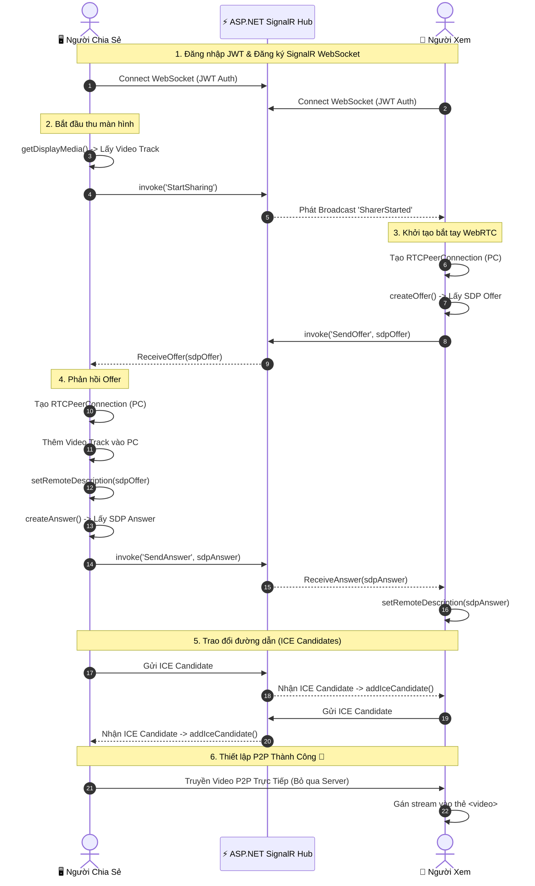

<!-- markdownlint-disable MD033 -->

  
  <h1 style="color: #2C3E50; font-size: 2.5em; margin-bottom: 10px;">🌐 WebRTC Real-Time Screen Sharing</h1>
  
Hệ thống chia sẻ màn hình theo thời gian thực (Real-time Peer-to-Peer Screen Sharing)

  
  

    
    
    
    
    
  

  
📑 Nội Dung Chính (Table of Contents)

  <ul style="margin-top: 15px; line-height: 1.8;">
    <li><a href="#gioi-thieu" style="color: #0366D6; text-decoration: none;">🚀 Giới Thiệu</a></li>
    <li><a href="#tinh-nang" style="color: #0366D6; text-decoration: none;">✨ Tính Năng Nổi Bật</a></li>
    <li><a href="#nguyen-ly" style="color: #0366D6; text-decoration: none;">💡 Nguyên Lý Hoạt Động Cốt Lõi</a></li>
    <li><a href="#so-do" style="color: #0366D6; text-decoration: none;">🔄 Sơ Đồ Luồng Hoạt Động (Sequence Diagram)</a></li>
    <li><a href="#cong-nghe" style="color: #0366D6; text-decoration: none;">🛠️ Công Nghệ Sử Dụng</a></li>
    <li><a href="#huong-dan" style="color: #0366D6; text-decoration: none;">🚀 Hướng Dẫn Khởi Chạy (Docker)</a></li>
    <li><a href="#demo" style="color: #0366D6; text-decoration: none;">🔑 Tài Khoản Demo</a></li>
    <li><a href="#chi-tiet" style="color: #0366D6; text-decoration: none;">🔬 Giải Thích Chi Tiết Code (Deep Dive)</a></li>
  </ul>

<h2 id="gioi-thieu" style="color: #24292E; border-bottom: 2px solid #eaecef; padding-bottom: 8px;">🚀 Giới Thiệu</h2>

  Đây là một hệ thống <strong>Screen Sharing</strong> hiệu năng cao, được thiết kế để giải quyết bài toán băng thông server khi stream video. Bằng cách kết hợp ASP.NET Core SignalR và WebRTC, dự án mang lại trải nghiệm xem màn hình với độ trễ gần như bằng không.

<h2 id="tinh-nang" style="color: #24292E; border-bottom: 2px solid #eaecef; padding-bottom: 8px; margin-top: 30px;">✨ Tính Năng Nổi Bật</h2>
<ul style="font-size: 1.1em; line-height: 1.8; color: #333;">
  <li>🎥 <strong style="color: #D32F2F;">Chất lượng Video Cao</strong>: Hỗ trợ truyền phát màn hình độ phân giải lên đến 1080p @ 30fps.</li>
  <li>⚡ <strong style="color: #F57C00;">Độ Trễ Cực Thấp (Ultra-low Latency)</strong>: Stream video P2P (Peer-to-Peer) trực tiếp giữa các Client.</li>
  <li>🛡️ <strong style="color: #388E3C;">Bảo Mật Tích Hợp</strong>: Sử dụng JWT token để xác thực, dữ liệu WebRTC được mã hóa mặc định.</li>
  <li>🔄 <strong style="color: #1976D2;">Xử Lý Kết Nối Thông Minh</strong>: Tự động phục hồi kết nối SignalR, hàng chờ (queue) ICE Candidate thông minh tránh lỗi bất đồng bộ.</li>
  <li>🐳 <strong style="color: #0288D1;">Triển Khai Trong 1 Phút</strong>: Đóng gói hoàn chỉnh bằng Docker & Docker Compose kèm theo Coturn server.</li>
</ul>

<h2 id="nguyen-ly" style="color: #24292E; border-bottom: 2px solid #eaecef; padding-bottom: 8px; margin-top: 30px;">💡 Nguyên Lý Hoạt Động Cốt Lõi</h2>

  <strong style="color: #005A9E; font-size: 1.1em;">⚠️ Tuyên Bố Thiết Kế Quan Trọng:</strong>
    
  

    1
    <strong>SignalR chỉ là "Trợ lý Bắt tay" (Signaling Server):</strong> Nhiệm vụ duy nhất của Backend là luân chuyển các gói tin siêu nhẹ gồm SDP Offer, SDP Answer, ICE Candidates và trạng thái Online/Offline.
  

  

    2
    <strong>TUYỆT ĐỐI KHÔNG TRUYỀN VIDEO QUA SERVER:</strong> Toàn bộ luồng hình ảnh/video được truyền <strong>trực tiếp giữa 2 trình duyệt</strong> thông qua <code>RTCPeerConnection</code> của WebRTC. Nhờ đó, Backend server hoàn toàn không chịu tải video, giúp hệ thống scale dễ dàng.
  

<h2 id="so-do" style="color: #24292E; border-bottom: 2px solid #eaecef; padding-bottom: 8px; margin-top: 30px;">🔄 Sơ Đồ Luồng Hoạt Động</h2>

Sơ đồ dưới đây mô tả quá trình từ lúc người dùng đăng nhập đến khi video được truyền thành công:

<h2 id="cong-nghe" style="color: #24292E; border-bottom: 2px solid #eaecef; padding-bottom: 8px; margin-top: 30px;">🛠️ Công Nghệ Sử Dụng</h2>
<table width="100%" style="border-collapse: separate; border-spacing: 10px;">
  <tr>
    <td width="33%" align="center" style="background-color: #F6F8FA; padding: 20px; border-radius: 10px; border: 1px solid #E1E4E8; box-shadow: 0 4px 6px rgba(0,0,0,0.04);">
      <h3 style="margin-top: 0; color: #512BD4;">Backend</h3>
       
      

        <strong>ASP.NET Core 10 Web API</strong> 
        SignalR Hub 
        Entity Framework Core 10 
        JWT Authentication
      

    </td>
    <td width="33%" align="center" style="background-color: #F6F8FA; padding: 20px; border-radius: 10px; border: 1px solid #E1E4E8; box-shadow: 0 4px 6px rgba(0,0,0,0.04);">
      <h3 style="margin-top: 0; color: #4FC08D;">Frontend</h3>
       
      

        <strong>Vue 3 (Composition API)</strong> 
        TypeScript & Pinia 
        Tailwind CSS v3 
        Native WebRTC API
      

    </td>
    <td width="33%" align="center" style="background-color: #F6F8FA; padding: 20px; border-radius: 10px; border: 1px solid #E1E4E8; box-shadow: 0 4px 6px rgba(0,0,0,0.04);">
      <h3 style="margin-top: 0; color: #2496ED;">Hạ Tầng (DevOps)</h3>
       
      

        <strong>Docker & Docker Compose</strong> 
        Nginx Web Server 
        Coturn (STUN/TURN Server)
      

    </td>
  </tr>
</table>

<h2 id="huong-dan" style="color: #24292E; border-bottom: 2px solid #eaecef; padding-bottom: 8px; margin-top: 30px;">🚀 Hướng Dẫn Khởi Chạy</h2>

  Hệ thống đã được đóng gói hoàn toàn trong Docker. Bạn <strong style="color: #D32F2F;">không cần</strong> cài đặt .NET SDK hay Node.js trên máy Host.

<h3 style="color: #0366D6;">1️⃣ Chạy Docker Compose</h3>

Mở terminal tại thư mục gốc của dự án (<code>d:\stream</code>) và chạy lệnh:

  <code style="color: #58A6FF; font-family: monospace; font-size: 1.1em;">docker compose up -d</code>

  <em>💡 Lệnh này sẽ tự động khởi tạo: Backend API (kèm DB SQLite), Frontend (chạy qua Nginx), và Coturn TURN server để xử lý NAT.</em>

<h3 style="color: #0366D6;">2️⃣ Truy cập Ứng dụng</h3>

Mở trình duyệt (khuyến nghị Chrome/Edge/Firefox mới nhất):

<ul style="font-size: 1.05em; line-height: 1.8;">
  <li><strong>Từ máy chủ (Host):</strong> <a href="http://localhost:5173" style="color: #0366D6; text-decoration: none;">http://localhost:5173</a></li>
  <li><strong>Từ mạng LAN:</strong> <code style="background-color: #f6f8fa; padding: 2px 6px; border-radius: 4px;">http://&lt;IP_LAN&gt;:5173</code> (ví dụ: <code style="background-color: #f6f8fa; padding: 2px 6px; border-radius: 4px;">http://192.168.2.3:5173</code>)</li>
</ul>

<h2 id="demo" style="color: #24292E; border-bottom: 2px solid #eaecef; padding-bottom: 8px; margin-top: 30px;">🔑 Tài Khoản Demo</h2>

Database được tự động seed sẵn các tài khoản sau để bạn test ngay lập tức:

  <table width="100%" border="0" cellspacing="0" cellpadding="12" style="border-collapse: collapse; text-align: left; border-radius: 8px; overflow: hidden; box-shadow: 0 4px 12px rgba(0,0,0,0.05);">
    <thead>
      <tr style="background-color: #0366D6; color: white;">
        <th style="font-weight: 600;">Vai Trò</th>
        <th style="font-weight: 600;">Username</th>
        <th style="font-weight: 600;">Password</th>
        <th style="font-weight: 600;">Phân quyền / Giao diện</th>
      </tr>
    </thead>
    <tbody style="background-color: white; border: 1px solid #E1E4E8;">
      <tr style="border-bottom: 1px solid #E1E4E8;">
        <td>🖥️ <strong>Người Chia Sẻ</strong></td>
        <td><code style="background-color: #f6f8fa; padding: 2px 6px; border-radius: 4px; color: #E36209;">sharer1</code></td>
        <td><code style="background-color: #f6f8fa; padding: 2px 6px; border-radius: 4px;">password123</code></td>
        <td>Có nút <strong>Start Sharing</strong> màn hình</td>
      </tr>
      <tr style="border-bottom: 1px solid #E1E4E8; background-color: #F8F9FA;">
        <td>🖥️ <strong>Người Chia Sẻ</strong></td>
        <td><code style="background-color: #f6f8fa; padding: 2px 6px; border-radius: 4px; color: #E36209;">sharer2</code></td>
        <td><code style="background-color: #f6f8fa; padding: 2px 6px; border-radius: 4px;">password123</code></td>
        <td>Có nút <strong>Start Sharing</strong> màn hình</td>
      </tr>
      <tr style="border-bottom: 1px solid #E1E4E8;">
        <td>👀 <strong>Người Xem</strong></td>
        <td><code style="background-color: #f6f8fa; padding: 2px 6px; border-radius: 4px; color: #005CC5;">viewer1</code></td>
        <td><code style="background-color: #f6f8fa; padding: 2px 6px; border-radius: 4px;">password123</code></td>
        <td>Chỉ có giao diện <strong>Dashboard</strong> xem luồng</td>
      </tr>
      <tr style="background-color: #F8F9FA;">
        <td>👀 <strong>Người Xem</strong></td>
        <td><code style="background-color: #f6f8fa; padding: 2px 6px; border-radius: 4px; color: #005CC5;">viewer2</code></td>
        <td><code style="background-color: #f6f8fa; padding: 2px 6px; border-radius: 4px;">password123</code></td>
        <td>Chỉ có giao diện <strong>Dashboard</strong> xem luồng</td>
      </tr>
    </tbody>
  </table>

<h2 id="chi-tiet" style="color: #24292E; border-bottom: 2px solid #eaecef; padding-bottom: 8px; margin-top: 30px;">🔬 Giải Thích Chi Tiết Code (Deep Dive)</h2>

  
1. Khởi tạo & Đăng ký Sự hiện diện (Presence)

  

    <ul style="margin: 0; padding-left: 20px; line-height: 1.6; color: #444;">
      <li><strong style="color: #0366D6;">Frontend (<code>useSignalR.ts</code>)</strong>: Trình duyệt tạo kết nối WebSocket bảo mật tới Hub kèm JWT Token.</li>
      <li><strong style="color: #0366D6;">Backend (<code>StreamHub.cs</code>)</strong>: Khi client kết nối (<code>OnConnectedAsync</code>), Hub lưu <code>ConnectionId</code>, <code>UserId</code> vào <code>ConcurrentDictionary</code>. Lệnh <code>Join()</code> trả về danh sách active sharers.</li>
    </ul>
  

  
2. Người Chia Sẻ bắt đầu thu màn hình

  

    <ul style="margin: 0; padding-left: 20px; line-height: 1.6; color: #444;">
      <li><strong style="color: #0366D6;">Frontend (<code>useWebRtcSharer.ts</code>)</strong>: Sử dụng chuẩn HTML5 <code style="background-color: #eaecef; padding: 2px 4px; border-radius: 4px;">navigator.mediaDevices.getDisplayMedia(...)</code>.</li>
      <li><strong style="color: #0366D6;">Backend</strong>: Ghi nhận trạng thái <code>_activeSharings</code> và Broadcast <code>SharerStarted</code> tới toàn bộ Viewers.</li>
    </ul>
  

  
3. Bắt tay WebRTC (Signaling Process)

  

    <ol style="margin: 0; padding-left: 20px; line-height: 1.6; color: #444;">
      <li style="margin-bottom: 8px;"><strong>Viewer tạo SDP Offer</strong>: <code>pc.createOffer()</code> &rarr; Gửi qua SignalR <code>SendOffer</code>.</li>
      <li style="margin-bottom: 8px;"><strong>Sharer nhận Offer</strong>: Tạo <code>RTCPeerConnection</code> riêng cho Viewer đó, <code>addTrack()</code> luồng màn hình vào, gọi <code>pc.setRemoteDescription()</code> và <code>pc.createAnswer()</code>.</li>
      <li><strong>Viewer nhận Answer</strong>: Áp dụng <code>pc.setRemoteDescription()</code>. Kết nối logic được thiết lập.</li>
    </ol>
  

  
4. Hàng chờ ICE Candidate (Xử lý Bất đồng bộ mạng)

  

    <ul style="margin: 0 0 15px 0; padding-left: 20px; line-height: 1.6; color: #444;">
      <li><strong>Vấn đề</strong>: ICE Candidates có thể đến <strong>trước</strong> khi hàm <code>setRemoteDescription</code> hoàn tất.</li>
      <li><strong>Giải pháp trong Code</strong>: Sử dụng một <strong>Pending Queue</strong>.</li>
    </ul>
    

<pre style="margin: 0;"><code class="language-typescript" style="color: #e1e4e8; font-family: monospace; font-size: 0.95em;">if (pc.remoteDescription &amp;&amp; pc.remoteDescription.type) {
  await pc.addIceCandidate(new RTCIceCandidate(candidate));
} else {
  // Đợi SDP xử lý xong
  pendingCandidates.get(connectionId).push(candidate); 
}</code></pre>
    

  

  
5. Phân Định Trách Nhiệm Thư Mục

  

    <table width="100%" border="0" cellspacing="0" cellpadding="10" style="border-collapse: collapse; text-align: left; border-radius: 6px; overflow: hidden; border: 1px solid #E1E4E8;">
      <thead>
        <tr style="background-color: #F6F8FA; color: #24292E; border-bottom: 1px solid #E1E4E8;">
          <th>Đường dẫn / Component</th>
          <th>Nhiệm vụ chính</th>
        </tr>
      </thead>
      <tbody style="color: #444; font-size: 0.95em;">
        <tr style="border-bottom: 1px solid #E1E4E8;">
          <td><code style="background-color: #F6F8FA; padding: 2px 6px; border-radius: 4px; color: #0366D6;">Backend/.../StreamHub.cs</code></td>
          <td>Trạm trung chuyển (Signaling) & Quản lý trạng thái Users.</td>
        </tr>
        <tr style="border-bottom: 1px solid #E1E4E8;">
          <td><code style="background-color: #F6F8FA; padding: 2px 6px; border-radius: 4px; color: #22863A;">frontend/.../useWebRtcSharer.ts</code></td>
          <td>Logic xử lý luồng <code>getDisplayMedia</code>, gửi SDP Answer.</td>
        </tr>
        <tr style="border-bottom: 1px solid #E1E4E8;">
          <td><code style="background-color: #F6F8FA; padding: 2px 6px; border-radius: 4px; color: #22863A;">frontend/.../useWebRtcViewer.ts</code></td>
          <td>Logic tự động mở luồng, gửi SDP Offer, nhận Video Stream.</td>
        </tr>
        <tr>
          <td><code style="background-color: #F6F8FA; padding: 2px 6px; border-radius: 4px; color: #6F42C1;">frontend/.../streamStore.ts</code></td>
          <td>State Management (Pinia) lưu danh sách các Stream đang active.</td>
        </tr>
      </tbody>
    </table>
  

  
Được thiết kế cho mục đích học tập & ứng dụng thực tế hệ thống <b>Realtime WebRTC</b>.

  
📝 <b>License:</b> MIT

