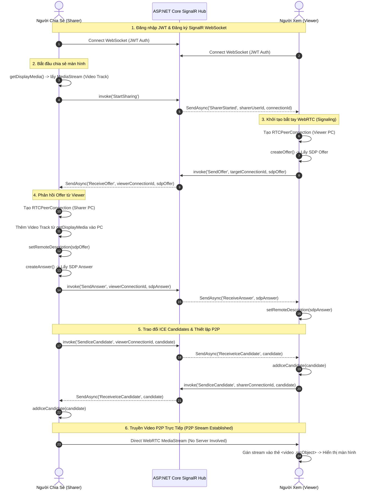

# WebRTC Realtime Screen Sharing System

Hệ thống chia sẻ màn hình theo thời gian thực (Real-time Peer-to-Peer Screen Sharing) được xây dựng trên kiến trúc **ASP.NET Core 10 Web API**, **SignalR Hub**, và **Vue 3 (Vite + Tailwind CSS + Pinia)**.

---

## 💡 Nguyên Lý Hoạt Động Cốt Lõi (Core Architecture)

> ⚠️ **Tuyên bố thiết kế quan trọng**:
>
> - **SignalR chỉ đóng vai trò Trợ lý Bắt tay (Signaling Server)**: Chỉ truyền các gói tin điều khiển siêu nhẹ (SDP Offer, SDP Answer, ICE Candidates và Trạng thái On/Off).
> - **TUYỆT ĐỐI KHÔNG TRUYỀN DỮ LIỆU VIDEO QUA SIGNALR / SERVER**: Toàn bộ luồng hình ảnh/video màn hình được truyền **trực tiếp giữa 2 trình duyệt (Peer-to-Peer)** thông qua **WebRTC `RTCPeerConnection`**. Server Backend hoàn toàn không phải gánh tải dữ liệu video.

---

## 🔄 Sơ Đồ Luồng Hoạt Động (Sequence Diagram)



---

## 📖 Giải Thích Chi Tiết Từng Bước Trong Code (Code Execution Flow)

### 1. Khởi tạo & Đăng ký Sự hiện diện (Presence Registration)

- **Frontend (`useSignalR.ts`)**:
  Trình duyệt tạo kết nối WebSocket bảo mật tới `https://192.168.2.3:5001/hubs/stream` kèm JWT Bearer token.
- **Backend (`StreamHub.cs`)**:
  Khi client kết nối (`OnConnectedAsync`), Hub lưu thông tin `ConnectionId`, `UserId`, `Username` vào `ConcurrentDictionary`.
  Khi client phát lệnh `Join()`, Hub trả về danh sách các Sharer đang active (`ActiveSharings`) và phát sự kiện `UserJoined` cho mọi người dùng khác.

---

### 2. Người Chia Sẻ bắt đầu thu màn hình (Sharer Flow)

- **File chính**: `src/views/SharerView.vue` & `src/composables/useWebRtcSharer.ts`
- **Các bước thực thi**:
  1. Người dùng bấm nút **"Start Sharing"**.
  2. Trình duyệt gọi API chuẩn HTML5:

     ```typescript
     const stream = await navigator.mediaDevices.getDisplayMedia({
       video: { width: { max: 1920 }, height: { max: 1080 }, frameRate: { max: 30 } },
       audio: false
     });
     ```

  3. Màn hình thu được gán vào `streamStore.localStream` và lập tức hiển thị trên thẻ `<video ref="previewEl">` của giao diện người chia sẻ (Local Preview).
  4. Trình duyệt gọi SignalR: `await invoke('StartSharing')`.
  5. **Backend (`StreamHub.cs`)** ghi nhận người dùng vào danh sách `_activeSharings` và phát tin tới toàn bộ Viewer:

     ```csharp
     await Clients.Others.SendAsync("SharerStarted", user.UserId, user.Username, Context.ConnectionId);
     ```

---

### 3. Người Xem kết nối & Bắt tay WebRTC (Viewer Flow)

- **File chính**: `src/views/ViewerDashboard.vue` & `src/composables/useWebRtcViewer.ts`
- **Các bước thực thi**:
  1. Khi nhận được tin `SharerStarted` (hoặc khi mới đăng nhập nhận `ActiveSharings`), Viewer tự động khởi tạo kết nối P2P tới Sharer qua hàm `connectToSharer(...)`:

     ```typescript
     const pc = new RTCPeerConnection(ICE_SERVERS);
     ```

  2. **Tạo SDP Offer (Phiếu yêu cầu kết nối)**:
     Viewer tạo SDP Offer (chứa thông tin mã hóa video codec, băng thông, cổng media mong muốn):

     ```typescript
     const offer = await pc.createOffer({ offerToReceiveVideo: true });
     await pc.setLocalDescription(offer);
     await invoke('SendOffer', sharerConnectionId, offer.sdp);
     ```

  3. **Sharer nhận Offer & Tạo SDP Answer (Phiếu chấp nhận kết nối)**:
     - Sharer nhận `ReceiveOffer` từ SignalR, tạo `RTCPeerConnection` mới dành riêng cho Viewer đó.
     - Sharer thêm các Track video thu từ màn hình vào connection này:

       ```typescript
       stream.getTracks().forEach(track => pc.addTrack(track, stream));
       ```

     - Sharer gán Offer của Viewer vào `setRemoteDescription`, tạo Answer:

       ```typescript
       await pc.setRemoteDescription(new RTCSessionDescription({ type: 'offer', sdp: sdpOffer }));
       const answer = await pc.createAnswer();
       await pc.setLocalDescription(answer);
       await invoke('SendAnswer', viewerConnectionId, answer.sdp);
       ```

  4. **Viewer nhận Answer**:
     - Viewer nhận tin `ReceiveAnswer`, thiết lập:

       ```typescript
       await pc.setRemoteDescription(new RTCSessionDescription({ type: 'answer', sdp: sdpAnswer }));
       ```

---

### 4. Trao đổi ICE Candidate & Kết nối P2P (ICE Exchange & Candidate Queueing)

- **Thử thách mạng**: Do người dùng nằm trong các lớp mạng NAT/Firewall/LAN khác nhau, hai trình duyệt phải trao đổi các địa chỉ IP/Port khả dụng (**ICE Candidates**).
- **Cơ chế Hàng chờ Pending ICE Candidate Queue**:
  Vì Candidate từ trình duyệt có thể đến **trước** khi hàm `setRemoteDescription` hoàn tất, ứng dụng sử dụng cơ chế hàng chờ:

  ```typescript
  if (pc.remoteDescription && pc.remoteDescription.type) {
    await pc.addIceCandidate(new RTCIceCandidate(candidate));
  } else {
    pendingCandidates.get(connectionId).push(candidate); // Đưa vào hàng chờ
  }
  ```

  Ngay khi `setRemoteDescription` vừa chạy xong, toàn bộ Candidate trong hàng chờ sẽ được áp dụng đồng loạt.

---

### 5. Hiển thị Video trên Giao diện Người Xem (Video Rendering)

- **File chính**: `src/components/VideoCard.vue`
- Khi kênh WebRTC P2P được thông suốt, sự kiện `pc.ontrack` trên trình duyệt Viewer tự động kích hoạt:

  ```typescript
  pc.ontrack = (event) => {
    const remoteStream = event.streams[0] || new MediaStream([event.track]);
    streamStore.updateSessionStream(sharerUserId, remoteStream);
  };
  ```

- Component `VideoCard.vue` phản ứng với `props.stream` thay đổi, gán luồng trực tiếp vào phần tử HTML5 `<video>` và kích hoạt phát tự động:

  ```typescript
  watch([() => props.stream, videoEl], ([stream, el]) => {
    if (el) {
      el.srcObject = stream ?? null;
      if (stream) el.play().catch(() => {});
    }
  }, { immediate: true });
  ```

---

## 🗂️ Phân Định Trách Nhiệm Thư Mục & Code (File Responsibilities)

| Thư mục / File | Vai trò & Chức năng trong hệ thống |
|---|---|
| `Backend/WebRtcScreenShare.Api/Hubs/StreamHub.cs` | SignalR Hub trung tâm quản lý Signaling (Offer, Answer, ICE) và trạng thái hiện diện (Join, StartSharing, StopSharing). |
| `frontend/src/composables/useSignalR.ts` | Quản lý kết nối WebSocket SignalR, token JWT auth, tự động kết nối lại (auto-reconnect). |
| `frontend/src/composables/useWebRtcSharer.ts` | Logic phía Sharer: thu màn hình qua `getDisplayMedia`, quản lý tập hợp kết nối P2P tới từng Viewer, xử lý Offer/Answer/ICE. |
| `frontend/src/composables/useWebRtcViewer.ts` | Logic phía Viewer: lắng nghe Sharer mới, tự động gửi Offer, quản lý luồng nhận P2P `pc.ontrack` và hàng chờ Pending ICE Candidates. |
| `frontend/src/stores/streamStore.ts` | Pinia Store lưu trữ trạng thái luồng xem trước `localStream` và Map các session đang xem `activeSessions`. |
| `frontend/src/components/VideoCard.vue` | Component hiển thị thẻ Video của Sharer trên Dashboard với hỗ trợ xem Fullscreen và tự động khôi phục khung hình. |

---

## 🛠️ Công Nghệ Sử Dụng (Technology Stack)

### Backend

- **ASP.NET Core 10 Web API**
- **SignalR Hub** (WebRTC Signaling)
- **Entity Framework Core 10** (SQL Server / LocalDB)
- **JWT Authentication**

### Frontend

- **Vue 3 (Composition API + TypeScript)**
- **Vite 6** (HTTPS Development Mode)
- **Tailwind CSS v3** & **Lucide Icons**
- **Pinia** (State Management)
- **Native WebRTC (`RTCPeerConnection`, `getDisplayMedia`)**

---

## 🚀 Hướng Dẫn Khởi Chạy

### 1. Chuẩn bị tài khoản Demo (Đã được Seed tự động trong DB)

| Tài khoản | Username | Password | Vai trò |
|---|---|---|---|
| Sharer 1 | `sharer1` | `password123` | Người chia sẻ |
| Sharer 2 | `sharer2` | `password123` | Người chia sẻ |
| Viewer 1 | `viewer1` | `password123` | Người xem |
| Viewer 2 | `viewer2` | `password123` | Người xem |

### 2. Chạy Backend (.NET 10 API)

```bash
cd Backend/src/WebRtcScreenShare.Api
dotnet run --launch-profile lan
```

*Lắng nghe tại `https://192.168.2.3:5001` và `http://192.168.2.3:5000`.*

### 3. Chạy Frontend (Vue 3 + Vite)

```bash
cd frontend
npm install
npm run dev:lan
```

*Lắng nghe tại `https://192.168.2.3:5173`.*

---

## 📜 License

MIT License - Được phát triển cho mục đích học tập & ứng dụng thực tế hệ thống Realtime WebRTC.
