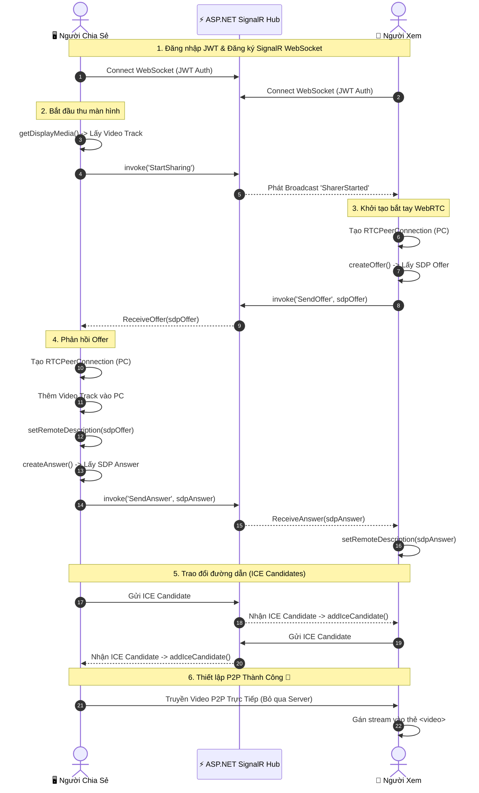

<!-- markdownlint-disable MD033 -->

<div align="center">
  
  <h1>🌐 WebRTC Real-Time Screen Sharing</h1>
  <p><strong>Hệ thống chia sẻ màn hình theo thời gian thực (Real-time Peer-to-Peer Screen Sharing)</strong></p>
  
  <p>
    
    
    
    
    
  </p>
</div>

---

<details open>
  <summary><b>📑 Nội Dung Chính (Table of Contents)</b></summary>
  <ol>
    <li><a href="#-giới-thiệu">Giới Thiệu</a></li>
    <li><a href="#-tính-năng-nổi-bật">Tính Năng Nổi Bật</a></li>
    <li><a href="#-nguyên-lý-hoạt-động-cốt-lõi">Nguyên Lý Hoạt Động Cốt Lõi</a></li>
    <li><a href="#-sơ-đồ-luồng-hoạt-động">Sơ Đồ Luồng Hoạt Động (Sequence Diagram)</a></li>
    <li><a href="#-công-nghệ-sử-dụng">Công Nghệ Sử Dụng</a></li>
    <li><a href="#-hướng-dẫn-khởi-chạy">Hướng Dẫn Khởi Chạy (Docker)</a></li>
    <li><a href="#-tài-khoản-demo">Tài Khoản Demo</a></li>
    <li><a href="#-giải-thích-chi-tiết-code">Giải Thích Chi Tiết Code (Deep Dive)</a></li>
  </ol>
</details>

---

## 🚀 Giới Thiệu

Đây là một hệ thống **Screen Sharing** hiệu năng cao, được thiết kế để giải quyết bài toán băng thông server khi stream video. Bằng cách kết hợp **ASP.NET Core SignalR** và **WebRTC**, dự án mang lại trải nghiệm xem màn hình với độ trễ gần như bằng không.

## ✨ Tính Năng Nổi Bật

- 🎥 **Chất lượng Video Cao**: Hỗ trợ truyền phát màn hình độ phân giải lên đến 1080p @ 30fps.
- ⚡ **Độ Trễ Cực Thấp (Ultra-low Latency)**: Stream video P2P (Peer-to-Peer) trực tiếp giữa các Client.
- 🛡️ **Bảo Mật Tích Hợp**: Sử dụng JWT token để xác thực, dữ liệu WebRTC được mã hóa mặc định.
- 🔄 **Xử Lý Kết Nối Thông Minh**: Tự động phục hồi kết nối SignalR, hàng chờ (queue) ICE Candidate thông minh tránh lỗi bất đồng bộ.
- 🐳 **Triển Khai Trong 1 Phút**: Đóng gói hoàn chỉnh bằng Docker & Docker Compose kèm theo Coturn server.

---

## 💡 Nguyên Lý Hoạt Động Cốt Lõi

<blockquote style="border-left: 4px solid #0078D4; padding: 10px; background-color: #f3f9ff; color: #333;">
  <strong>⚠️ Tuyên Bố Thiết Kế Quan Trọng:</strong>
  <br/><br/>
  🔸 <strong>SignalR chỉ là "Trợ lý Bắt tay" (Signaling Server):</strong> Nhiệm vụ duy nhất của Backend là luân chuyển các gói tin siêu nhẹ gồm SDP Offer, SDP Answer, ICE Candidates và trạng thái Online/Offline.<br/>
  🔸 <strong>TUYỆT ĐỐI KHÔNG TRUYỀN VIDEO QUA SERVER:</strong> Toàn bộ luồng hình ảnh/video được truyền <strong>trực tiếp giữa 2 trình duyệt</strong> thông qua <code>RTCPeerConnection</code> của WebRTC. Nhờ đó, Backend server hoàn toàn không chịu tải video, giúp hệ thống scale dễ dàng.
</blockquote>

---

## 🔄 Sơ Đồ Luồng Hoạt Động

Sơ đồ dưới đây mô tả quá trình từ lúc người dùng đăng nhập đến khi video được truyền thành công:



---

## 🛠️ Công Nghệ Sử Dụng

<table>
  <tr>
    <td width="33%" align="center">
      <b>Backend</b><br/>
      <br/>
      ASP.NET Core 10 Web API<br/>
      SignalR Hub<br/>
      Entity Framework Core 10<br/>
      JWT Authentication
    </td>
    <td width="33%" align="center">
      <b>Frontend</b><br/>
      <br/>
      Vue 3 (Composition API)<br/>
      TypeScript & Pinia<br/>
      Tailwind CSS v3<br/>
      Native WebRTC API
    </td>
    <td width="33%" align="center">
      <b>Hạ Tầng (DevOps)</b><br/>
      <br/>
      Docker & Docker Compose<br/>
      Nginx Web Server<br/>
      Coturn (STUN/TURN Server)
    </td>
  </tr>
</table>

---

## 🚀 Hướng Dẫn Khởi Chạy

Hệ thống đã được đóng gói hoàn toàn trong Docker. Bạn **không cần** cài đặt .NET SDK hay Node.js trên máy Host.

### 1️⃣ Chạy Docker Compose
Mở terminal tại thư mục gốc của dự án (`d:\stream`) và chạy lệnh:

```bash
docker compose up -d
```
> Lệnh này sẽ tự động khởi tạo: Backend API (kèm DB SQLite), Frontend (chạy qua Nginx), và Coturn TURN server để xử lý NAT.

### 2️⃣ Truy cập Ứng dụng
Mở trình duyệt (khuyến nghị Chrome/Edge/Firefox mới nhất):
- **Từ máy chủ (Host):** [http://localhost:5173](http://localhost:5173)
- **Từ mạng LAN:** `http://<IP_LAN>:5173` (ví dụ: `http://192.168.2.3:5173`)

---

## 🔑 Tài Khoản Demo

Database được tự động seed sẵn các tài khoản sau để bạn test ngay lập tức:

| Vai Trò | Username | Password | Phân quyền / Giao diện |
| :--- | :--- | :--- | :--- |
| 🖥️ **Người Chia Sẻ** | `sharer1` | `password123` | Có nút **Start Sharing** màn hình |
| 🖥️ **Người Chia Sẻ** | `sharer2` | `password123` | Có nút **Start Sharing** màn hình |
| 👀 **Người Xem** | `viewer1` | `password123` | Chỉ có giao diện **Dashboard** xem luồng |
| 👀 **Người Xem** | `viewer2` | `password123` | Chỉ có giao diện **Dashboard** xem luồng |

---

## 🔬 Giải Thích Chi Tiết Code (Deep Dive)

<details>
<summary><b>1. Khởi tạo & Đăng ký Sự hiện diện (Presence)</b></summary>
<br/>

- **Frontend (`useSignalR.ts`)**: Trình duyệt tạo kết nối WebSocket bảo mật tới Hub kèm JWT Token.
- **Backend (`StreamHub.cs`)**: Khi client kết nối (`OnConnectedAsync`), Hub lưu `ConnectionId`, `UserId` vào `ConcurrentDictionary`. Lệnh `Join()` trả về danh sách active sharers.

</details>

<details>
<summary><b>2. Người Chia Sẻ bắt đầu thu màn hình</b></summary>
<br/>

- **Frontend (`useWebRtcSharer.ts`)**: Sử dụng chuẩn HTML5 `navigator.mediaDevices.getDisplayMedia(...)`.
- **Backend**: Ghi nhận trạng thái `_activeSharings` và Broadcast `SharerStarted` tới toàn bộ Viewers.

</details>

<details>
<summary><b>3. Bắt tay WebRTC (Signaling Process)</b></summary>
<br/>

1. **Viewer tạo SDP Offer**: `pc.createOffer()` -> Gửi qua SignalR `SendOffer`.
2. **Sharer nhận Offer**: Tạo `RTCPeerConnection` riêng cho Viewer đó, `addTrack()` luồng màn hình vào, gọi `pc.setRemoteDescription()` và `pc.createAnswer()`.
3. **Viewer nhận Answer**: Áp dụng `pc.setRemoteDescription()`. Kết nối logic được thiết lập.

</details>

<details>
<summary><b>4. Hàng chờ ICE Candidate (Xử lý Bất đồng bộ mạng)</b></summary>
<br/>

- **Vấn đề**: ICE Candidates có thể đến **trước** khi hàm `setRemoteDescription` hoàn tất.
- **Giải pháp trong Code**: Sử dụng một **Pending Queue**.
  ```typescript
  if (pc.remoteDescription && pc.remoteDescription.type) {
    await pc.addIceCandidate(new RTCIceCandidate(candidate));
  } else {
    pendingCandidates.get(connectionId).push(candidate); // Đợi SDP xử lý xong
  }
  ```
</details>

<details>
<summary><b>5. Phân Định Trách Nhiệm Thư Mục</b></summary>
<br/>

| Đường dẫn / Component | Nhiệm vụ chính |
|---|---|
| `Backend/.../StreamHub.cs` | Trạm trung chuyển (Signaling) & Quản lý trạng thái Users. |
| `frontend/.../useWebRtcSharer.ts` | Logic xử lý luồng `getDisplayMedia`, gửi SDP Answer. |
| `frontend/.../useWebRtcViewer.ts` | Logic tự động mở luồng, gửi SDP Offer, nhận Video Stream. |
| `frontend/.../streamStore.ts` | State Management (Pinia) lưu danh sách các Stream đang active. |

</details>

---

<div align="center">
  <p>Được thiết kế cho mục đích học tập & ứng dụng thực tế hệ thống <b>Realtime WebRTC</b>.</p>
  <p>📝 <b>License:</b> MIT</p>
</div>
