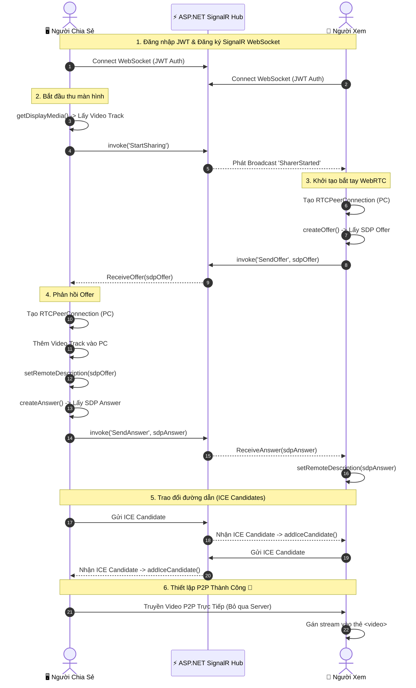

<!-- markdownlint-disable MD033 -->

  
  <h1>🌐 WebRTC Real-Time Screen Sharing</h1>
  
<strong>Hệ thống chia sẻ màn hình theo thời gian thực (Real-time Peer-to-Peer Screen Sharing)</strong>

  
  

    
    
    
    
    
  

  
<b>📑 Nội Dung Chính (Table of Contents)</b>

  <ul>
    <li><a href="#gioi-thieu">Giới Thiệu</a></li>
    <li><a href="#tinh-nang">Tính Năng Nổi Bật</a></li>
    <li><a href="#nguyen-ly">Nguyên Lý Hoạt Động Cốt Lõi</a></li>
    <li><a href="#so-do">Sơ Đồ Luồng Hoạt Động (Sequence Diagram)</a></li>
    <li><a href="#cong-nghe">Công Nghệ Sử Dụng</a></li>
    <li><a href="#huong-dan">Hướng Dẫn Khởi Chạy (Docker)</a></li>
    <li><a href="#demo">Tài Khoản Demo</a></li>
    <li><a href="#chi-tiet">Giải Thích Chi Tiết Code (Deep Dive)</a></li>
  </ul>

<h2 id="gioi-thieu">🚀 Giới Thiệu</h2>

  Đây là một hệ thống <strong>Screen Sharing</strong> hiệu năng cao, được thiết kế để giải quyết bài toán băng thông server khi stream video. Bằng cách kết hợp <strong>ASP.NET Core SignalR</strong> và <strong>WebRTC</strong>, dự án mang lại trải nghiệm xem màn hình với độ trễ gần như bằng không.

<h2 id="tinh-nang">✨ Tính Năng Nổi Bật</h2>
<ul>
  <li>🎥 <strong>Chất lượng Video Cao</strong>: Hỗ trợ truyền phát màn hình độ phân giải lên đến 1080p @ 30fps.</li>
  <li>⚡ <strong>Độ Trễ Cực Thấp (Ultra-low Latency)</strong>: Stream video P2P (Peer-to-Peer) trực tiếp giữa các Client.</li>
  <li>🛡️ <strong>Bảo Mật Tích Hợp</strong>: Sử dụng JWT token để xác thực, dữ liệu WebRTC được mã hóa mặc định.</li>
  <li>🔄 <strong>Xử Lý Kết Nối Thông Minh</strong>: Tự động phục hồi kết nối SignalR, hàng chờ (queue) ICE Candidate thông minh tránh lỗi bất đồng bộ.</li>
  <li>🐳 <strong>Triển Khai Trong 1 Phút</strong>: Đóng gói hoàn chỉnh bằng Docker & Docker Compose kèm theo Coturn server.</li>
</ul>

<h2 id="nguyen-ly">💡 Nguyên Lý Hoạt Động Cốt Lõi</h2>
<blockquote style="border-left: 4px solid #0078D4; padding: 10px; background-color: #f3f9ff; color: #333; margin: 10px 0;">
  <strong>⚠️ Tuyên Bố Thiết Kế Quan Trọng:</strong>
    
  🔸 <strong>SignalR chỉ là "Trợ lý Bắt tay" (Signaling Server):</strong> Nhiệm vụ duy nhất của Backend là luân chuyển các gói tin siêu nhẹ gồm SDP Offer, SDP Answer, ICE Candidates và trạng thái Online/Offline. 
  🔸 <strong>TUYỆT ĐỐI KHÔNG TRUYỀN VIDEO QUA SERVER:</strong> Toàn bộ luồng hình ảnh/video được truyền <strong>trực tiếp giữa 2 trình duyệt</strong> thông qua <code>RTCPeerConnection</code> của WebRTC. Nhờ đó, Backend server hoàn toàn không chịu tải video, giúp hệ thống scale dễ dàng.
</blockquote>

<h2 id="so-do">🔄 Sơ Đồ Luồng Hoạt Động</h2>

Sơ đồ dưới đây mô tả quá trình từ lúc người dùng đăng nhập đến khi video được truyền thành công:

<h2 id="cong-nghe">🛠️ Công Nghệ Sử Dụng</h2>
<table width="100%">
  <tr>
    <td width="33%" align="center">
      <b>Backend</b> 
       
      ASP.NET Core 10 Web API 
      SignalR Hub 
      Entity Framework Core 10 
      JWT Authentication
    </td>
    <td width="33%" align="center">
      <b>Frontend</b> 
       
      Vue 3 (Composition API) 
      TypeScript & Pinia 
      Tailwind CSS v3 
      Native WebRTC API
    </td>
    <td width="33%" align="center">
      <b>Hạ Tầng (DevOps)</b> 
       
      Docker & Docker Compose 
      Nginx Web Server 
      Coturn (STUN/TURN Server)
    </td>
  </tr>
</table>

<h2 id="huong-dan">🚀 Hướng Dẫn Khởi Chạy</h2>

  Hệ thống đã được đóng gói hoàn toàn trong Docker. Bạn <strong>không cần</strong> cài đặt .NET SDK hay Node.js trên máy Host.

<h3>1️⃣ Chạy Docker Compose</h3>

Mở terminal tại thư mục gốc của dự án (<code>d:\stream</code>) và chạy lệnh:

<pre><code class="language-bash">docker compose up -d</code></pre>

<blockquote style="border-left: 4px solid #6c757d; padding: 10px; background-color: #f8f9fa; margin: 10px 0;">
  Lệnh này sẽ tự động khởi tạo: Backend API (kèm DB SQLite), Frontend (chạy qua Nginx), và Coturn TURN server để xử lý NAT.
</blockquote>

<h3>2️⃣ Truy cập Ứng dụng</h3>

Mở trình duyệt (khuyến nghị Chrome/Edge/Firefox mới nhất):

<ul>
  <li><strong>Từ máy chủ (Host):</strong> <a href="http://localhost:5173">http://localhost:5173</a></li>
  <li><strong>Từ mạng LAN:</strong> <code>http://&lt;IP_LAN&gt;:5173</code> (ví dụ: <code>http://192.168.2.3:5173</code>)</li>
</ul>

<h2 id="demo">🔑 Tài Khoản Demo</h2>

Database được tự động seed sẵn các tài khoản sau để bạn test ngay lập tức:

<table width="100%" border="1" cellspacing="0" cellpadding="8" style="border-collapse: collapse; text-align: left;">
  <thead>
    <tr style="background-color: #f3f9ff;">
      <th>Vai Trò</th>
      <th>Username</th>
      <th>Password</th>
      <th>Phân quyền / Giao diện</th>
    </tr>
  </thead>
  <tbody>
    <tr>
      <td>🖥️ <strong>Người Chia Sẻ</strong></td>
      <td><code>sharer1</code></td>
      <td><code>password123</code></td>
      <td>Có nút <strong>Start Sharing</strong> màn hình</td>
    </tr>
    <tr>
      <td>🖥️ <strong>Người Chia Sẻ</strong></td>
      <td><code>sharer2</code></td>
      <td><code>password123</code></td>
      <td>Có nút <strong>Start Sharing</strong> màn hình</td>
    </tr>
    <tr>
      <td>👀 <strong>Người Xem</strong></td>
      <td><code>viewer1</code></td>
      <td><code>password123</code></td>
      <td>Chỉ có giao diện <strong>Dashboard</strong> xem luồng</td>
    </tr>
    <tr>
      <td>👀 <strong>Người Xem</strong></td>
      <td><code>viewer2</code></td>
      <td><code>password123</code></td>
      <td>Chỉ có giao diện <strong>Dashboard</strong> xem luồng</td>
    </tr>
  </tbody>
</table>

<h2 id="chi-tiet">🔬 Giải Thích Chi Tiết Code (Deep Dive)</h2>

  
<b>1. Khởi tạo & Đăng ký Sự hiện diện (Presence)</b>

  

    <ul>
      <li><strong>Frontend (<code>useSignalR.ts</code>)</strong>: Trình duyệt tạo kết nối WebSocket bảo mật tới Hub kèm JWT Token.</li>
      <li><strong>Backend (<code>StreamHub.cs</code>)</strong>: Khi client kết nối (<code>OnConnectedAsync</code>), Hub lưu <code>ConnectionId</code>, <code>UserId</code> vào <code>ConcurrentDictionary</code>. Lệnh <code>Join()</code> trả về danh sách active sharers.</li>
    </ul>
  

  
<b>2. Người Chia Sẻ bắt đầu thu màn hình</b>

  

    <ul>
      <li><strong>Frontend (<code>useWebRtcSharer.ts</code>)</strong>: Sử dụng chuẩn HTML5 <code>navigator.mediaDevices.getDisplayMedia(...)</code>.</li>
      <li><strong>Backend</strong>: Ghi nhận trạng thái <code>_activeSharings</code> và Broadcast <code>SharerStarted</code> tới toàn bộ Viewers.</li>
    </ul>
  

  
<b>3. Bắt tay WebRTC (Signaling Process)</b>

  

    <ol>
      <li><strong>Viewer tạo SDP Offer</strong>: <code>pc.createOffer()</code> -> Gửi qua SignalR <code>SendOffer</code>.</li>
      <li><strong>Sharer nhận Offer</strong>: Tạo <code>RTCPeerConnection</code> riêng cho Viewer đó, <code>addTrack()</code> luồng màn hình vào, gọi <code>pc.setRemoteDescription()</code> và <code>pc.createAnswer()</code>.</li>
      <li><strong>Viewer nhận Answer</strong>: Áp dụng <code>pc.setRemoteDescription()</code>. Kết nối logic được thiết lập.</li>
    </ol>
  

  
<b>4. Hàng chờ ICE Candidate (Xử lý Bất đồng bộ mạng)</b>

  

    <ul>
      <li><strong>Vấn đề</strong>: ICE Candidates có thể đến <strong>trước</strong> khi hàm <code>setRemoteDescription</code> hoàn tất.</li>
      <li><strong>Giải pháp trong Code</strong>: Sử dụng một <strong>Pending Queue</strong>.</li>
    </ul>
<pre><code class="language-typescript">if (pc.remoteDescription &amp;&amp; pc.remoteDescription.type) {
  await pc.addIceCandidate(new RTCIceCandidate(candidate));
} else {
  pendingCandidates.get(connectionId).push(candidate); // Đợi SDP xử lý xong
}</code></pre>
  

  
<b>5. Phân Định Trách Nhiệm Thư Mục</b>

  

    <table width="100%" border="1" cellspacing="0" cellpadding="8" style="border-collapse: collapse; text-align: left;">
      <tr style="background-color: #f3f9ff;">
        <th>Đường dẫn / Component</th>
        <th>Nhiệm vụ chính</th>
      </tr>
      <tr>
        <td><code>Backend/.../StreamHub.cs</code></td>
        <td>Trạm trung chuyển (Signaling) & Quản lý trạng thái Users.</td>
      </tr>
      <tr>
        <td><code>frontend/.../useWebRtcSharer.ts</code></td>
        <td>Logic xử lý luồng <code>getDisplayMedia</code>, gửi SDP Answer.</td>
      </tr>
      <tr>
        <td><code>frontend/.../useWebRtcViewer.ts</code></td>
        <td>Logic tự động mở luồng, gửi SDP Offer, nhận Video Stream.</td>
      </tr>
      <tr>
        <td><code>frontend/.../streamStore.ts</code></td>
        <td>State Management (Pinia) lưu danh sách các Stream đang active.</td>
      </tr>
    </table>
  

  
Được thiết kế cho mục đích học tập & ứng dụng thực tế hệ thống <b>Realtime WebRTC</b>.

  
📝 <b>License:</b> MIT

